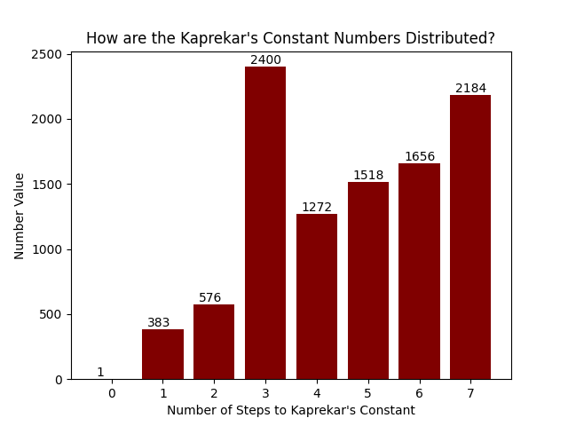

# Kaprekar's Constant (6174)

A few Python scripts that calculate and visualize the number of steps for a candidate number to reach Kaprekar's Constant, ie. 6174. The result is the following:



*For more information on Kaprekar's Constant, please refer to the FOOTNOTE.*

## Getting Started

### Dependencies
This program was written in Python v3.6. I used the following Python libraries:
* Matplotlib
* json

### Executing program

Uncomment the print statements and modify/add your own test cases before running `kaprekars_constant.py`.

Run `dictionary_to_json.py` to create a json file with all possible # steps to reach 6174 and its associated numbers that take that many steps. Refer to `kaprekar.json` for the output. Change the outfile location to create a new file.

Run `plot_kaprekar.py` to see the above png in both your IDE and save it as a png. Change the outfile location to create a new file. You can even save it as a jpg or pdf, if you name accordingly.

## Possible Next Steps
* Use the json data with all the numbers and associated steps to create a plot
* Decrease memory-complexity of 4-step algorithm, in particular, the use of arrays of length 4 to represent the numbers

## FOOTNOTE: What is Kaprekar's Constant?
Taken from [its Wikipedia page](https://en.wikipedia.org/wiki/6174_(number)#:~:text=6174%20is%20known%20as%20Kaprekar's,Kaprekar.):

```
6174 is known as Kaprekar's constant after the Indian mathematician D. R. Kaprekar. This number is notable for the following rule:

1. Take any four-digit number, using at least two different digits (leading zeros are allowed).
2. Arrange the digits in descending and then in ascending order to get two four-digit numbers, adding leading zeros if necessary.
3. Subtract the smaller number from the bigger number.
4. Go back to step 2 and repeat.

The above process, known as Kaprekar's routine, will always reach its fixed point, 6174, in at most 7 iterations. Once 6174 is reached, the process will continue yielding 7641 – 1467 = 6174. For example, choose 1495:

9541 – 1459 = 8082
8820 – 0288 = 8532
8532 – 2358 = 6174
7641 – 1467 = 6174

The only four-digit numbers for which Kaprekar's routine does not reach 6174 are repdigits such as 1111, which give the result 0000 after a single iteration. All other four-digit numbers eventually reach 6174 if leading zeros are used to keep the number of digits at 4.
```
